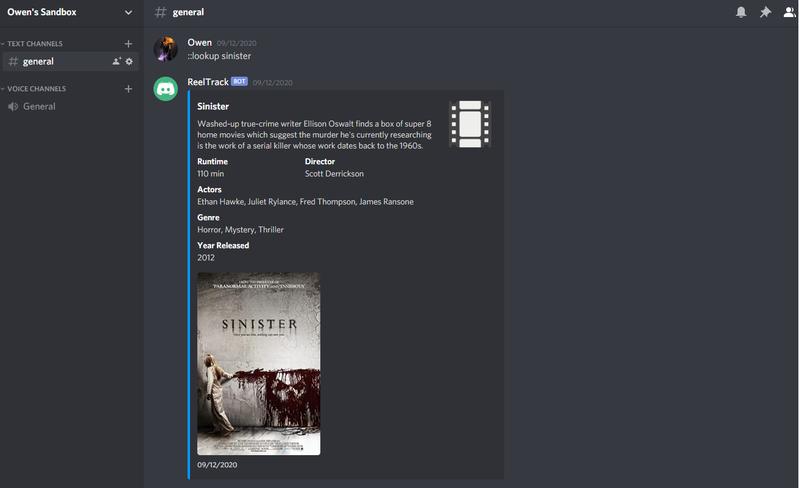

# ReelTrack
ReelTrack is a discord bot that allows you to lookup movies and add them into a list that anyone in the server can see.

All commands for the bot must be prepended with "::".

Example Commands
::lookup [Movie name]
- This command will query the OMDB API for information about the movie and reply in the channel with an embed.

